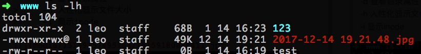

### 常用命令

#### ls [选项] [文件或目录]
查看文件列表
> 选项：
>     -a 显示所有文件，包括隐藏文件
>     -l 显示详细信息
>     -d 查看目录属性
>     -h 人性化显示文件大小
>     -i 显示inode



> 常见三种文件类型
> - 普通文件
> d 目录
> l 软链接文件

tips: 后边那九位，每三位为一组，代表文件u所有者、g所属组、o其他人
r读(4) w写(2) x执行(1)

-------

#### mkdir [选项] [目录]
创建目录
> 选项：
> -p 递归创建

#### rm [选项] [文件或目录]
删除文件或目录
> 选项：
> -r 删除目录
> -f 强制

```
rm -rf file/dir
```
不加 -f，问答式删除；rmdir只能删除空目录

-------

#### cp [选项] [原文件或目录] [目标目录]
复制文件或目录
> 选项：
> -r 复制目录
> -p 连带文件属性复制
> -d 若源文件是链接文件，则复制链接属性
> -a 相当于 -pdr

tips: 目标目录后面加个文件名，就是改名复制；如果不加，就是原名复制

#### mv [原文件或目录] [目标目录]
剪切或改名命令

tips: mv 命令在剪切目录时不用加 -r，而 cp、rm 在操作目录时需要加 -r
源文件与目标文件不在一个目录下，就是剪切；如果在一个目录下，就是改名。

-------

#### ln [选项] [原文件] [目标文件]
创建连接文件
> 选项：
> -s 创建软链接

#### find [搜索目录] [搜索条件]
搜索目录文件
> 通配符：
> * 匹配任意内容
> ？匹配任意一个字符
> [] 匹配任意一个括号内的字符

tips：find 命令搜的是文件名完全一致的文件，如果想模糊匹配(包含更多的内容)，需要用通配符

```
find ./dir/ -name test.log 
```
> -iname 不区分大小写

```
find /var/log/ -mtime +10
```
> -10 10天内修改的文件
> 10  第10天前当天修改的文件
> +10 10天前修改的文件
> atime 文件访问时间
> ctime 修改文件属性的时间
> mtime 修改文件内容的时间

```
find ./ -size +20k
```
> -20k 小于20kb的文件
> 20k  等于20kb的文件
> +20k 大于20kb的文件
> 按kb: k, 按兆: M

```
find ./ -size +20k -a -size -50k -exec ls -lh {} \;
```
> -a 逻辑与
> -o 逻辑或

查看当前目录下大于20kb并且小于50kb的文件，查询的结果用ls显示详细信息

#### grep [选项] [字符串] [文件名]
搜索文件中的字符串
> 选项：
> -i 忽略大小写
> -v 排除指定字符串

-------

#### 压缩命令
> 常用压缩格式：
> .zip
> .gz
> .bz2
> .tar.gz
> .tar.bz2

* zip [选项] [压缩文件名] [源文件或目录]

> 选项
> -r 压缩目录

```
zip -r file.zip ./dir
```

* unzip [压缩文件] [目录]  `#解压.zip文件`

* gzip [源文件]  `#压缩为.gz格式的压缩文件，源文件会消失`

* gzip -c [源文件] > [压缩文件] `#压缩为.gz格式，源文件保留`

* gip -r [目录] `#压缩目录下所有的子文件，但是不能压缩目录本身`

* gzip -d [压缩文件] 或 gunzip [压缩文件] `#解压.gz文件`

* bzip [源文件] `#压缩为.bz2格式，源文件会消失，不能压缩目录`

* bzip -k [源文件] `#压缩为.bz2格式，源文件保留`

* bzip -d [压缩文件] 或 bunzip2 [压缩文件] `#解压.bz2文件，-k保留压缩文件`

#### tar [选项] [打包文件名] [源文件]
> 选项：
> -c 打包
> -x 解打包
> -v 显示过程
> -f 指定打包后的文件
> -z 压缩为.tar.gz格式
> -j 压缩为.tar.bz2格式

```
tar -zcvf file.tar.gz dir files 
tar -zxvf file.tar.gz

tar -jcvf file.tar.bz2 files
tar -jxvf file.tar.bz2 -C /tmp/

tar -ztvf test.tar.gz #测试查看压缩包
```


